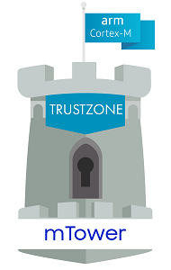
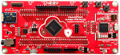

#  mTower

## Contents
1. [Introduction](#1-introduction)
2. [License](#2-license)
3. [Platforms supported](#3-platforms-supported)
4. [Get and build mTower software](#4-get-and-build-mtower-software)
5. [Source code structure](#5-source-code-structure)
6. [Coding standards](#6-coding-standards)
7. [Documentation](#7-documentation)
8. [Contributing](#8-contributing)
9. [Other Remarks](#9-other-remarks)

## 1. Introduction
The `mTower` is a new Trusted Execution Environment (TEE) specially designed
to protect size-constrained IoT devices based on Cortex-m23 MCU. Usage mTower
pre-embedded into the microcontroller, a module developer can use a simple SDK
that based on Global Platform API standards to add security to their solution.

---
## 2. License
The software is distributed mostly under the
[BSD 2-Clause](http://opensource.org/licenses/BSD-2-Clause) open source
license.
Some third-party components are used. Licensing terms for these components can
be seen in [COPYING] file.

---
## 3. Platforms supported

| **NuMaker-PFM-M2351** | **How to add a platform** |  |  |
|------------------|------------------------|----------------------|----------------------|
|[](docs/numaker_pfm_m2351.md)| [](docs/port-new-platform.md)| |


Several platforms are supported. In order to manage slight differences
between platforms, a `PLATFORM` flag has been introduced.

| Platform              | Composite PLATFORM flag     | Maintained |
|-----------------------|-----------------------------|------------|
| [NuMaker-PFM-M2351]   |`PLATFORM=numaker_pfm_m2351` | v0.1       |

Fo information on adding a new platform see the [how to add a platform].

---
## 4. Get and build mTower software
Please see [build] for instructions how to run mTower on various devices.

---
## 5. Source code structure
The general [source code structure] for mTower is similar to the structure of the
multy platforms source code.

---
## 6. Coding standards
In this project we are trying to adhere to the mTower coding convention 
(see [CodingStyle]). However there are a few exceptions that we had to make since
the code also uses other open source components.

---
## 7. Documentation
The mTower documentation for the project is located in the [docs] folder.
The latest version of the specification that describes the mTower source code
can be generated using [doxygen] tool from command line. To generate
documentation, use

```sh
$ make docs_gen
```
command, and to view generated docs use

```sh
$ make docs_show
```

---
## 8. Contributing
If you want to contribute to the mTower project and make it better, your help is
very welcome. Contributing is also a great way to learn more about social
coding on Github, new technologies and and their ecosystems. [How to contribute
you can find here](.github/CONTRIBUTING.md).

---
## 9. Other remarks
TBD

[docs]: ./docs
[COPYING]: COPYING
[build]: docs/build.md
[how to add a platform]: docs/port-new-platform.md
[CodingStyle]: docs/mtower-coding-standard.md
[source code structure]: docs/source-code-structure.md
[doxygen]: http://www.stack.nl/~dimitri/doxygen/index.html
[NuMaker-PFM-M2351]: http://www.nuvoton.com.cn/hq/products/iot-solution/iot-platform/numaker-maker-platform/numaker-pfm-m2351?__locale=en
