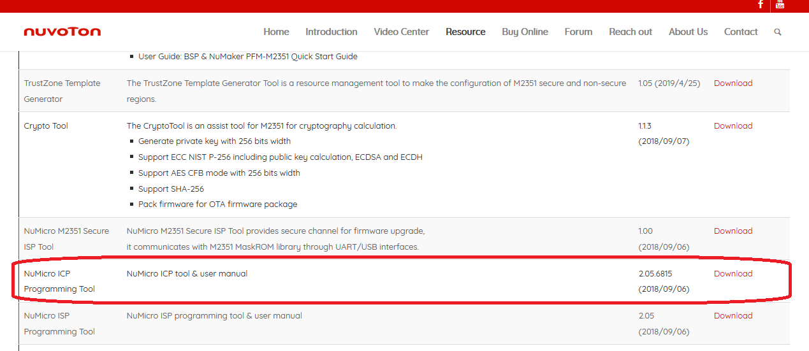
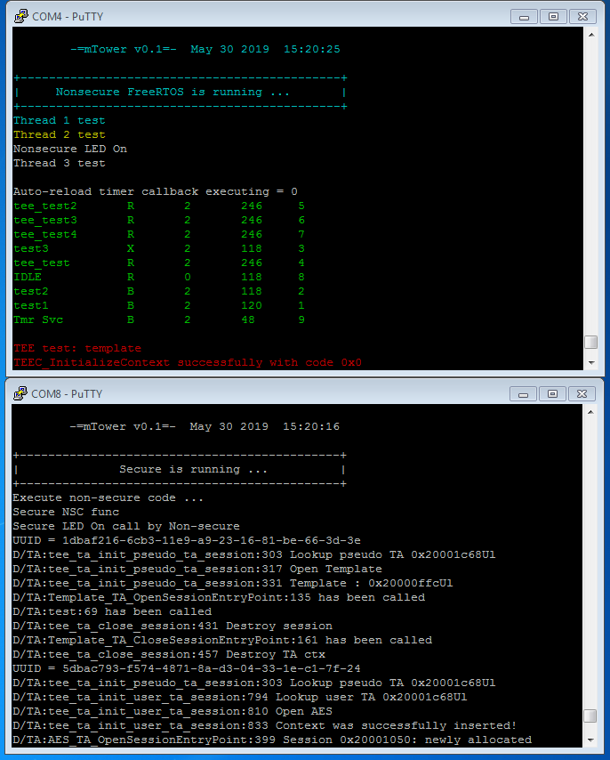

# mTower on M2351-Badge

# Contents
1. [Introduction](#1-introduction)
2. [Regular build](#2-regular-build)
3. [Nuvoton NuMicro ICP Programming Tool](#3-nuvoton-numicro-icp-programming-tool)
4. [Flash mTower on the device and run](#4-flash-mtower-on-the-device-and-run)
5. [References](#5-references)

## 1. Introduction
The instructions here will tell how to run mTower on the [M2351-Badge] board.

## 2. Regular build
Start out by following the "Get and build the solution" in the [build.md] file.
> Warning: Need to download the toolchain (exec. `make toolchain`).

## 3. Nuvoton NuMicro ICP Programming Tool
Please note that Nuvoton NuMicro ICP Programming Tool is used under Windows OS.
It can be downloaded from [here](https://m2351.nuvoton.com/resource/)

Once you download the installer and start it, follow the instructions shown in installer window.

## 4. Flash mTower on the device and run
1. Start NuMicro ICP Programming Tool. A window will open where you must select M2351 target chip and click **"Continue"** button:

2. Connect the board to your PC via USB ICE connector and click **"Connect"** button in NuMicro ICP Programming Tool window.

3. Once board successfully connects, chip ID and info will show in corresponding fields of window. Next you must select images to flash onto board. Click **"APROM"** button and select previously compiled file `mtower_s.hex` (secure world image), and click **"APROM_NS"** button and select `mtower_ns.hex` file (normal world image). Check the **"APROM"** and **"APROM_NS"** checkboxes in the bottom of window, in Programming group. Click the **"Start"** button to start flashing process.

4. We use console for debugging: one will connect via UART for Secure/Non-Secure input/output.

5. Open console/terminal window (e.g., Putty) using 115200 speed setting with 8 bits with no parity check. Press **"Reset"** button on M2351-Badge board, and you should see output in terminal window, like one shown below. Note that menu task is running in infinite loop, so the output shall not stop.

## 5. References

[https://www.nuvoton.com/products/microcontrollers/arm-cortex-m23-mcus/m2351-series/?tab=1](https://www.nuvoton.com/products/microcontrollers/arm-cortex-m23-mcus/m2351-series/?tab=1)

[build.md]: build.md
[M2351-Badge]: schemes/m2351_badge
