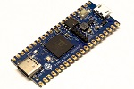

# mTower on Pine64 Ox64 - RISC-V BL808

[](https://wiki.pine64.org/wiki/Ox64)

# Contents
1. [Introduction](#1-introduction)
2. [Regular build](#2-regular-build)
3. [BLDevCube Tool](#3-bldevcube-programming-tool)
4. [Flash mTower on the device and run](#4-flash-mtower-on-the-device-and-run)
5. [References](#5-references)

## 1. Introduction
The instructions here will tell how to run mTower on the [Pine64 Ox64] board.

## 2. Regular build
Start out by following the "Get and build the solution" in the [build.md] file.
> Warning: Need to download the toolchain (exec. `make toolchain`).

## 3. BlDevCube Programming Tool
> TBD

## 4. Flash mTower on the device and run
```sh
make flash
```

## 5. References

[build.md]: build.md
[Pine64 Ox64]: https://wiki.pine64.org/wiki/Ox64
