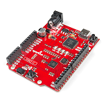

# mTower on SparkFun RED-V RedBoard - SiFive RISC-V FE310

# Contents
1. [Introduction](#1-introduction)
2. [Regular build](#2-regular-build)
3. [JLINK Programming Tool](#3-jlink-programming-tool)
4. [Flash mTower on the device and run](#4-flash-mtower-on-the-device-and-run)
5. [References](#5-references)

## 1. Introduction
The instructions here will tell how to run mTower on the [SparkFun RED-V RedBoard] board.

## 2. Regular build
Start out by following the "Get and build the solution" in the [build.md] file.
> Warning: Need to download the toolchain (exec. `make toolchain`).

## 3. Jlink Programming Tool
> TBD

## 4. Flash mTower on the device and run
 > TBD

## 5. References

[https://www.sparkfun.com/products/15594](https://www.sparkfun.com/products/15594)

[build.md]: build.md
[SparkFun RED-V RedBoard]: https://www.sparkfun.com/products/15594
