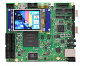

# mTower on V2M-MPS2-Qemu

[](https://developer.arm.com/documentation/100964/1114/Microcontroller-Prototyping-System-2?lang=en)

# Contents
1. [Introduction](#1-introduction)
2. [Regular build](#2-regular-build)
3. [How to run](#3-how-to-run)
4. [How to debug](#4-how-to-debug)
5. [References](#5-references)

## 1. Introduction
The instructions here will tell how to run mTower on the [V2M-MPS2] board.

## 2. Regular build
Start out by following the [Get and build the solution](https://github.com/Samsung/mTower/blob/master/docs/build.md#2-get-and-build-the-solution) in the [build.md] file.
> Warning: Need to download the toolchain (exec. `make toolchain`).

To run or debug, need to install the `qemu-system-arm`
```
sudo apt-get install qemu-system-arm
```

## 3. How to run

> TBD

## 4. How to debug
```
make debug
```
We use nc consoles for debugging: one will connect for Secure and one for Non-Secure input/output.
```
nc 127.0.0.1 1235
```
```
nc 127.0.0.1 1236
```

## 5. References

[How To Install qemu-system-arm on Ubuntu 20.04](https://installati.one/ubuntu/20.04/qemu-system-arm/)  
[AN505 - Example IoT Kit Subsystem Design for a V2M-MPS2+](https://developer.arm.com/documentation/dai0505/latest/)  
[Arm MPS2 and MPS2+ FPGA Prototyping Boards Technical Reference Manual Version 2.0](https://developer.arm.com/documentation/100112/0200?lang=en)  
[Arm Cortex-M33 Devices Generic User Guide r0p4](https://developer.arm.com/documentation/100235/0004?lang=en)  
[Arm CoreLink SSE-200 Subsystem for Embedded Technical Reference Manual r2p0](https://developer.arm.com/documentation/101104/0200/programmers-model/base-element/non-secure-privilege-control-block)  

[build.md]: build.md
[V2M-MPS2]: https://developer.arm.com/documentation/100964/1114/Microcontroller-Prototyping-System-2?lang=en
